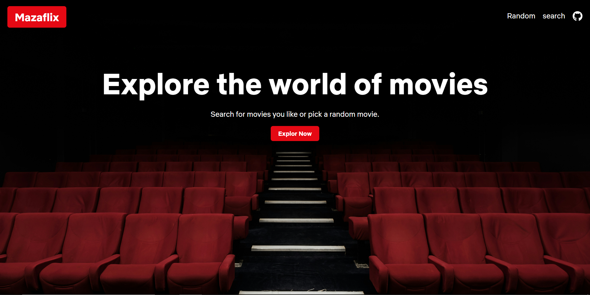
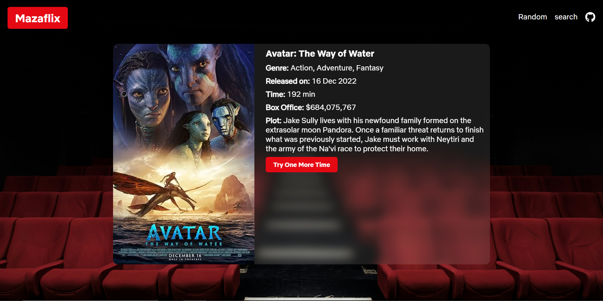

# MazaFlix - An Entertainment Based App

## Table of contents

- [Overview](#overview)
  - [Basic Idea](#Basic-Idea)
  - [Screenshot](#screenshot)
  - [Links](#links)
- [My process](#my-process)
  - [Built with](#built-with)
  - [What I learned](#what-i-learned)
  - [Continued development](#continued-development)
- [Author](#author)

## Overview

### Basic-Idea

The primary goal of this project is to create an engaging platform that offers personalized movie recommendations for users who are uncertain about what to watch next. Additionally, users can easily search for specific films to access detailed information about them. This project is personal and open-source, allowing anyone to contribute and enhance its features. There are no copyright restrictions, encouraging collaboration and creativity within the community.

### Screenshot

### Links

- Live Site URL: [MovieFlix](https://zohaibxjackie.github.io/MazaFlix/)

## My process

### Built with

- React
- Desktop-first workflow
- [React](https://reactjs.org/) - JS library

### What I learned

This was an amazing project. I learned a lot from it. I learned how to use fetch in react js, react-icons etc. Overall, It is was a great experience because of my own interest in movies.

### Continued development

I will add feed in the homepage. Hopefully, next time when you see this app, there will be a feed.

## Author

- Website - [Muhammad Zohaib](https://muhammadzohaib4.wordpress.com/)
- Frontend Mentor - [@zohaibxJackie](https://www.frontendmentor.io/profile/zohaibxJackie)
- Instagram - [@muhammadzohaibofficial1](https://www.instagram.com/muhammadzohaibofficial1?igsh=bHQwN3FoMm5idXd2)

